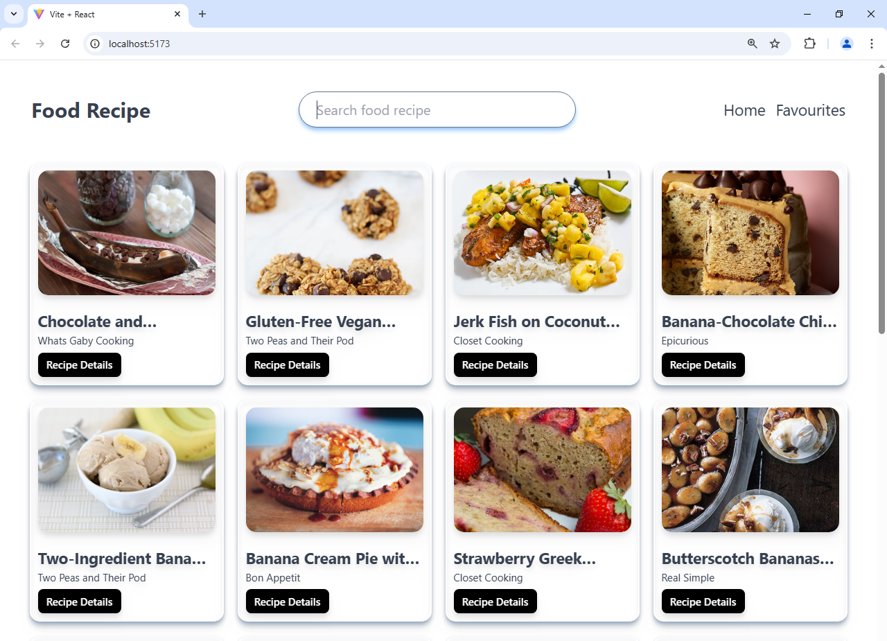
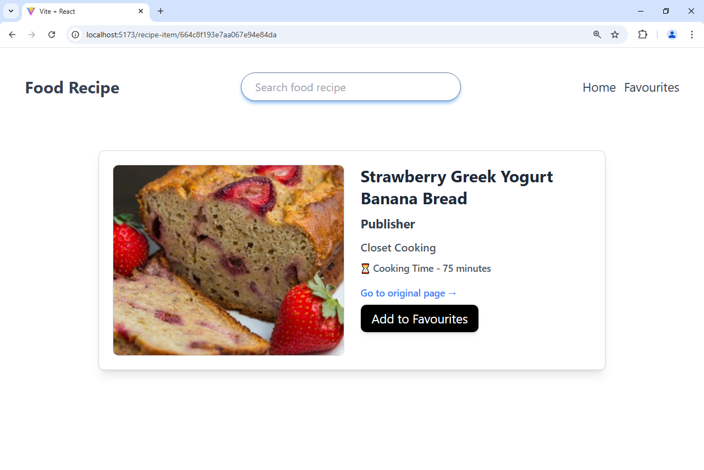

## 🍽️ Food Recipe App

A simple **React.js** application that allows users to **search for food recipes**, view recipe details, and save their favorite recipes. The app also provides links to the original recipe websites.

## ✨ Features

- 🔍 **Search for Recipes** by name or ingredients.
- ⭐ **Add Recipes to Favorites** for quick access.
- 📖 **View Recipe Details**.
- 🔗 **Visit the Original Recipe Source** for more details.

## 🛠️ Technologies Used

- React.js ⚛️
- JavaScript (ES6+)
- Tailwind CSS
- API for fetching recipes

## 🚀 Getting Started

### 1️⃣ Clone the Repository

```sh
git clone https://github.com/ArshadShaik07/food-recipe-app.git
cd food-recipe-app
```

### 2️⃣ Install Dependencies

```sh
npm install
```

### 3️⃣ Start the Development Server

```sh
npm run dev
```

The app will run at **http://localhost:5173/**.

## 📸 Screenshots




Made by - Arshad
